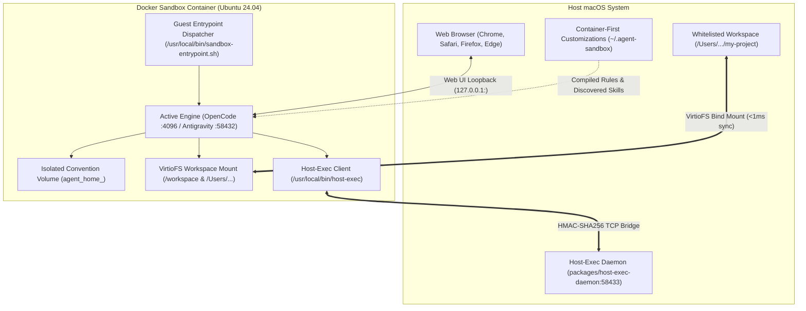

# Agent Sandbox: Multi-Agent Container Sandbox for macOS

A high-performance container sandbox for autonomous AI coding agents (**OpenCode**, **Google Antigravity**, and extensible custom engines) using Docker on macOS. It enables agents to execute shell commands, compile code, and manage dependencies inside an isolated Linux container without risking host system files, credentials, or toolchain stability.

---

## Why Agent Sandbox?

Autonomous AI coding agents routinely need to execute arbitrary shell commands (`bash`, `npm`, `pip`, `rm -rf`, compiler builds). Running these directly on your macOS host introduces significant risks:
- **Destructive Commands**: Accidental file deletion or misconfigured scripts can damage host files outside the current workspace.
- **Credential Exposure**: Unsandboxed processes have direct read access to `~/.ssh`, `~/.aws`, macOS Keychain, browser storage, and sensitive environment variables.
- **System Pollution**: Agent-driven package installations can alter host global dependencies and system configurations.

**Agent Sandbox** solves this by enforcing a hard container boundary while preserving seamless macOS developer ergonomics:

| Feature | Unsandboxed Default | Agent Sandbox |
| :--- | :--- | :--- |
| **Command Execution** | Runs directly on macOS host with full user permissions | Confined to isolated Ubuntu 24.04 Linux container |
| **Secret & System Isolation** | Full access to `~/.ssh`, `~/.aws`, Keychain, `/System` | Physically inaccessible; host files outside workspaces are isolated |
| **Supported Engines** | Single engine tied to host | Pluggable multi-agent architecture (OpenCode, Antigravity, etc.) |
| **File Editing Ergonomics** | Native macOS editors | Native macOS editors with <1ms VirtioFS live synchronization |
| **Path Parity** | Host paths (`/Users/...`) | Exact 1:1 host path parity (`/Users/...` preserved in container) |
| **macOS Native Tool Access** | Direct host binary access | Controlled access via HMAC-authenticated, policy-gated Host Bridge |
| **State Persistence** | Stored directly on host | Retained across restarts via isolated named Docker volumes |

---

## Architecture & How It Works

Agent Sandbox operates with a decoupled, web-first architecture. Each agent engine runs inside an isolated container service profile and exposes its web interface over local loopback. Engine services are generated from `engines/<name>/manifest.yaml` plus the shared `config/compose.common.yaml` fragment; `docker-compose.yml` itself is fully generic and contains no engine-specific content.
- **OpenCode**: Runs web server on port `4096` (`http://127.0.0.1:4096`).
- **Antigravity**: Runs language server on port `58432` (`https://localhost:58432`).



---

## Quickstart

### Prerequisites
- **macOS** (Apple Silicon or Intel)
- **Docker Desktop** or **OrbStack** (with VirtioFS enabled)
- **Python 3** on host

### 1. Clone the Repository
```bash
git clone https://github.com/battery-staple/antigravity-container.git
cd antigravity-container
```

### 2. Setup CLI
Symlink the CLI script into your `PATH`:
```bash
sudo ln -sf $(pwd)/bin/agent-sandbox /usr/local/bin/agent-sandbox
```

### 3. Whitelist Workspace & Start
```bash
# Whitelist your project workspace (defaults to current directory if omitted)
agent-sandbox workspace add /path/to/workspace

# Start an engine (e.g. opencode or antigravity)
agent-sandbox start opencode

# Or start specific engines concurrently:
agent-sandbox start opencode antigravity
```

### 4. Access the Web Interface
```bash
# Opens browser to active engine Web UI
agent-sandbox ui

# Or specify the engine explicitly:
agent-sandbox ui opencode
agent-sandbox ui antigravity
```

---

## Core Capabilities

### 1. Host-Exec Bridge (macOS Host Utilities)
Because the sandbox container runs Linux, macOS-native binaries (such as `xcodebuild`, iOS Simulator utilities, or system dialogs) cannot run directly inside the container. The Host-Exec bridge provides a secure, audited gateway for the agent to execute specific host binaries on the macOS host.

Security is enforced through a strict whitelist policy defined in `~/.agent-sandbox/whitelist.yaml`. Inside the container, the agent invokes allowed utilities transparently using `host-exec <command>` and can inspect active permissions with `host-exec --list`.

### 2. Pre-Installed Toolchains & State Persistence
System compilers and base tools are declared in [`Dockerfile.sandbox`](file:///Users/rohengiralt/Documents/Code/LLM/antigravity-container/Dockerfile.sandbox):
- **Node.js & JavaScript**: Node.js 22 (LTS), `npm`, `yarn`, `pnpm`, `bun`
- **Python**: Python 3.12 (`python3`, `pip`, `venv`)
- **Go**: Go 1.23 (`go`, `GOPATH=/home/developer/go`)
- **Java & Kotlin**: OpenJDK 21 (LTS), Kotlin CLI compiler v2.1.10, Gradle v8.12.1
- **Linters & Formatters**: `ktlint`, `google-java-format`
- **C/C++**: `build-essential` (`gcc`, `g++`, `make`)

User modifications and package caches persist in engine-isolated named Docker volumes (`agent_home_<engine>`):
- `npm install -g <pkg>` installs to `~/.npm-global` without root and persists across container rebuilds.
- `pip install --user <pkg>` installs to `~/.local` and persists across container rebuilds.
- `~/.gradle` and `~/go` module caches persist across container restarts.

### 3. Container-First Customizations: Rules & Skills
The sandbox automatically discovers and integrates agent skills and rules without exposing host files:
- **Rule Compilation Hierarchy**: Deterministically aggregates built-in common rules (`customizations/rules/*.md`), common user rules (`~/.agent-sandbox/common/rules/*.md`), built-in engine rules (`engines/<engine>/rules/*.md`), engine user rules (`~/.agent-sandbox/<engine>/rules/*.md`), and host global rules, shadowing them into the container without modifying host files.
- **Skill Discovery**: Scans `~/.agent-sandbox/{common, <engine>}/skills/` and JSON skill catalogs (`skills.json`, `.agents/skills.json`), mounting discovered external skills read-only (`:ro`).

Inspect active skills and compiled rules using:
```bash
agent-sandbox rules
agent-sandbox skills
```

---

## Command Reference

| Command | Description |
| :--- | :--- |
| `agent-sandbox start <engine...>` | Start one or more engines (e.g. `agent-sandbox start antigravity`). |
| `agent-sandbox stop [engine...]` | Stop running sandbox containers and host bridge. |
| `agent-sandbox restart [engine...]` | Restart sandbox containers. |
| `agent-sandbox build [engine...]` | Rebuild the sandbox container image after Dockerfile or installer changes. |
| `agent-sandbox status` | Display status of available engines, containers, workspaces, and bridge. |
| `agent-sandbox ui [engine]` | Open engine Web UI in desktop browser. |
| `agent-sandbox workspace add [path]` | Whitelist a workspace directory (current directory if omitted). |
| `agent-sandbox workspace remove <path>` | Remove a workspace from the whitelist. |
| `agent-sandbox workspace list` | List all whitelisted workspaces. |
| `agent-sandbox rules [engine]` | Display compiled rules hierarchy and sources. |
| `agent-sandbox skills [engine]` | Display discovered directory and catalog skills. |
| `agent-sandbox open [subpath]` | Open `~/.agent-sandbox/` directory in macOS Finder. |
| `agent-sandbox host-bridge [start|stop|status]` | Manage the macOS host binary execution bridge daemon. |
