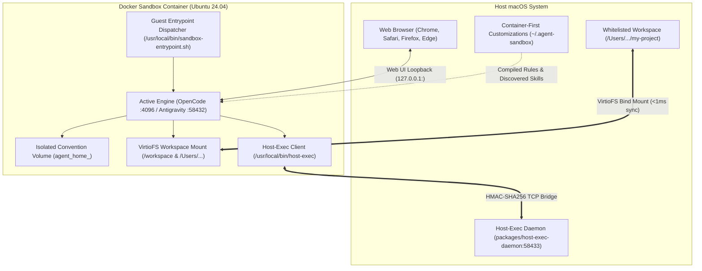
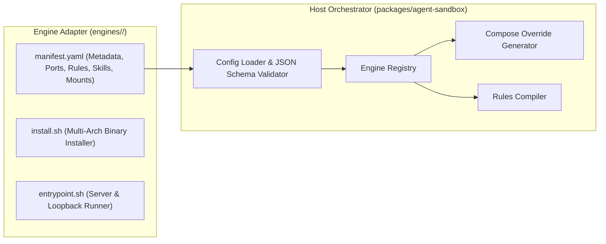

# Architectural Blueprint: Multi-Agent Container Sandbox (Agent Sandbox)

## 1. Executive Summary & Core Objective

The **Multi-Agent Container Sandbox** (`agent-sandbox`) provides a unified, secure, high-performance containerized execution runtime for autonomous AI coding agents (such as **OpenCode**, **Google Antigravity**, and future engines) using Docker on macOS.

### 1.1 The Core Problem & Security Invariant

Autonomous coding agents routinely execute shell commands, compile source trees, and manipulate environments. Running these tools directly on macOS exposes developers to critical hazards:

- Accidental filesystem destruction (e.g. `rm -rf /` or recursive deletion of root/home directories).
- Exposure of sensitive host credentials (`~/.ssh`, `~/.aws`, Keychain, browser cookies, API tokens).
- System-wide environment pollution from unvetted global package managers (`brew`, `npm`, `pip`).

**Core Security Invariant**: The agent must have full autonomy to execute arbitrary terminal commands, install packages, and compile projects inside an isolated Linux container, while remaining **strictly physically incapable** of accessing, modifying, or executing binaries on the host macOS system outside explicitly whitelisted project directories.



---

## 2. Two-Tier Sandbox Architecture & Mental Model

The platform enforces two distinct, independent security layers:

1. **Outer Layer — Docker Container Isolation**:
   - The primary security perimeter. The agent runtime executes inside an isolated Ubuntu 24.04 Linux container.
   - Host system files, `~/.ssh`, `~/.aws`, Keychain, and non-whitelisted paths are physically unmounted and inaccessible.
   - Whitelisted workspaces are bind-mounted at their exact host absolute paths, preserving full path parity across host and guest.
   - Persistent user data and agent memory reside on isolated named Docker volumes (`agent_home_<name>`).

2. **Inner Layer — Agent Tool Security Policy (`BypassSandbox`)**:
   - Inside the container, the execution engine still operates tool security policies.
   - Commands with `BypassSandbox: false` run offline and restricted to workspace boundaries.
   - Commands with `BypassSandbox: true` enable network and container root filesystem modifications, prompting the user for approval.
   - Crucially, `BypassSandbox: true` **never escapes the Linux container**.

---

## 3. Pluggable Engine Adapter Architecture

The platform decouples the container infrastructure from specific agent backends using pluggable **Engine Adapters**.



### 3.1 The Engine Adapter Contract

Every engine lives in `engines/<name>/` and implements three files:

1. `manifest.yaml`: Declarative metadata specifying the engine name, port, web URL, rule target, skill directory, catalogs, and mounts.
2. `install.sh`: An idempotent, multi-architecture (arm64/amd64) shell script that installs the engine binary into `/usr/local/bin/`.
3. `entrypoint.sh`: Starts the engine daemon or web server, binding to `0.0.0.0`.

### 3.2 Formal JSON Schema (`config/engine-manifest.schema.json`)

Engine manifests are validated against a JSON Schema (Draft 2020-12):

- `name`: Must match `^[a-z0-9_-]+$` and strictly equal the parent directory name.
- `port`: Integer between 1 and 65535 (the single source of truth for networking).
- `web_url`: URI opened by the `agent-sandbox ui [engine]` command.
- `rules`: Target file path in container and host source files.
- `skills`: Target skills directory and catalog files.
- `mounts`: Host directory paths to bind-mount if present.

### 3.3 Dynamic Compose Override Generation

The base `docker-compose.yml` is fully generic and contains zero hardcoded agent ports, names, or engine references. All engine-specific compose content is generated at runtime into `~/.agent-sandbox/docker-compose.override.yml`. When starting an engine, the orchestrator:

- Loads the engine-agnostic service fragment (`config/compose.common.yaml`) as the shared runtime defaults (image, build context, caps, resources, shared memory, dev ports, host-exec env).
- Emits a complete service per active engine by merging that fragment with engine identity (`container_name: agent-sandbox-<name>`, `ENGINE=<name>`, `SANDBOX_SKILLS_TARGET` from `manifest.skills.target_dir`), the convention home volume (`agent_home_<name>:/home/developer`), the host-exec IPC auth mount, and the dynamic per-run mounts:
  - Injects port forwards (`127.0.0.1:<port>:<port>`).
  - Injects whitelisted workspace bind mounts (`:cached`).
  - Injects compiled rule shadow-mounts.
  - Injects discovered catalog skills (`:ro`) and directory skills.
  - Injects engine-specific configuration mounts.
- Adds the top-level convention volumes (`agent_home_<name>`).

Because the override defines exactly the requested engines, `docker compose up` needs no `--profile` filtering.

### 3.4 Convention Volumes & Legacy Migration

Each engine mounts an isolated named volume:

```text
agent_home_<name>:/home/developer
```

To preserve user data from older sandbox versions, `agent_sandbox.compose.volumes` automatically detects legacy `antigravity_home_persist` volumes and migrates data to `agent_home_antigravity` via a transient copy container before starting.

---

## 4. Container-First Customizations (`~/.agent-sandbox/`)

Customizations are structured cleanly under `~/.agent-sandbox/`:

```text
~/.agent-sandbox/
├── whitelist.yaml                  # Active whitelisted workspaces and commands
├── ipc/                            # Shared HMAC secrets and PID files
├── logs/                           # Host bridge and execution logs
├── docker-compose.override.yml     # Dynamically generated override
├── common/                         # Universal customizations (all engines)
│   ├── rules/                      # Common rules (*.md)
│   └── skills/                     # Common skills (<skill_name>/SKILL.md)
├── opencode/                       # Engine-specific customizations
│   ├── AGENTS.md                   # Compiled rule file shadowed into container
│   ├── rules/                      # OpenCode-specific rules (*.md)
│   └── skills/                     # OpenCode-specific skills
└── antigravity/                    # Engine-specific customizations
    ├── GEMINI.md                   # Compiled rule file shadowed into container
    ├── rules/                      # Antigravity-specific rules (*.md)
    └── skills/                     # Antigravity-specific skills
```

### 4.1 5-Layer Rule Compilation Hierarchy

Rules are compiled deterministically in strict priority order:

1. **Built-in Common Container Rules**: `customizations/rules/*.md` (universal container isolation, path parity, and `host-exec` usage).
2. **Common User Sandbox Rules**: `~/.agent-sandbox/common/rules/*.md` (user rules applied across all engines).
3. **Built-in Engine Rules**: `engines/<engine>/rules/*.md` (repo rules specific to that engine, e.g. Antigravity's `BypassSandbox` policy).
4. **Engine-Specific User Rules**: `~/.agent-sandbox/<engine>/rules/*.md` (user overrides for that specific engine).
5. **Host Global Rules**: Candidate files declared in `manifest.yaml` (e.g. `~/.config/opencode/AGENTS.md` or `~/.gemini/GEMINI.md`).

The compiled output is saved to `~/.agent-sandbox/<engine>/<target>` and bind-mounted over the container target path. This ensures each container agent receives only accurate, relevant rules without ever modifying host rule files.

### 4.2 Dual Skill Resolution Pipeline

Skills are resolved through two complementary engines:

- **`DirectorySkillResolver`**: Scans `~/.agent-sandbox/common/skills/` and `~/.agent-sandbox/<engine>/skills/`. Subdirectories containing `SKILL.md` are mounted into the engine's `skills.target_dir`. Engine-specific skills override common skills of the same name.
- **`CatalogSkillResolver`**: Discovers skills referenced in JSON catalog files (`skills.json`, `.agents/skills.json`), traverses recursive `"inherits"` chains with cycle detection, validates host paths, prunes skills inside workspaces, and mounts external skill repositories `:ro`.

---

## 5. Host Binary Execution Bridge (Host-Exec)

### 5.1 Architecture & HMAC Authentication

Because the container runs Linux, macOS-native binaries (`xcodebuild`, Simulator `open`, Keychain) cannot execute directly inside the container.

- The **Host-Exec Daemon** runs on macOS, listening on `127.0.0.1:58433`.
- The **Host-Exec Guest Client** (`/usr/local/bin/host-exec`) runs inside the container.
- Requests are authenticated via HMAC-SHA256 signatures using a shared token mounted at `/var/run/host-exec`.

### 5.2 Whitelist Policy & Concurrency

The whitelist policy in `~/.agent-sandbox/whitelist.yaml` defines allowed commands and regexes:

- **Non-blocking parallel execution**: Asynchronous command execution without head-of-line blocking.
- **Modal Serialization**: Interactive AppleScript dialogs acquire a FIFO lock to prevent overlapping popups.
- **Process Reaping**: Orphaned child processes are automatically terminated upon client disconnect.

---

## 6. Engine Authoring Guide: Adding a New Agent Engine

To add support for a new agent engine (e.g. `claude-code` or `aider`):

1. **Create Engine Directory**:

   ```bash
   mkdir -p engines/<name>
   ```

2. **Create `engines/<name>/manifest.yaml`**:

   ```yaml
   name: <name>
   port: <port>
   web_url: http://127.0.0.1:<port>
   rules:
     target_file: ~/.config/<name>/AGENTS.md
     host_sources:
       - ~/.config/<name>/AGENTS.md
   skills:
     target_dir: ~/.config/<name>/skills
   mounts:
     - ~/.config/<name>
   ```

3. **Create `engines/<name>/install.sh`**:
   Must install the engine binary to `/usr/local/bin/<name>` (`chmod +x`), fail fast with
   `[Sandbox Error]` on failure. Use the engine's supported distribution channel
   (e.g. OpenCode V2: Node-only `npm install -g @opencode/cli@$OPENCODE_VERSION`).

4. **Create `engines/<name>/entrypoint.sh`**:
   Must start the engine server in the foreground (Docker-supervised). OpenCode V2 example:

   ```bash
   #!/usr/bin/env bash
   set -e
   exec opencode serve --hostname 0.0.0.0 --port 4096 "$@"
   ```

   (`opencode web` was removed in V2; `serve` is the API+web server.)

5. **(Optional) Add a per-engine user config adapter**:
   Engine-specific runtime settings (e.g. OpenCode `server.username/password` in
   `~/.agent-sandbox/<name>/config.yaml`) live in `packages/agent-sandbox/src/agent_sandbox/engines/<name>.py`
   behind the generic `EngineAdapter` interface (`parse_user_config` once, `compose_env`,
   `status_lines`, `scaffold`). Generic code (`cli.py`, `compose/generator.py`) must never
   branch on engine names; adding a new engine shape touches only its adapter module.

6. **(Optional) Add Engine-Specific Built-in Rules**:
   Add any engine-specific guidance (e.g. tool calling conventions or engine security policies) to `engines/<name>/rules/*.md`.

7. **Rebuild Container**:

   ```bash
   bin/agent-sandbox build
   bin/agent-sandbox start <name>
   ```

---

## 7. Exact File Manifest

| File Path | Description |
| :--- | :--- |
| `config/engine-manifest.schema.json` | JSON Schema (Draft 2020-12) defining engine manifest constraints. |
| `engines/opencode/` | OpenCode engine adapter (`manifest.yaml`, `install.sh`, `entrypoint.sh`). |
| `engines/antigravity/` | Google Antigravity engine adapter (`manifest.yaml`, `install.sh`, `entrypoint.sh`). |
| `Dockerfile.sandbox` | Multilingual Ubuntu 24.04 image dynamically executing engine installers. |
| `config/compose.common.yaml` | Engine-agnostic docker compose service fragment merged into every generated engine service. |
| `docker-compose.yml` | Generic compose project file (project name, empty services/volumes); engines are generated into `~/.agent-sandbox/docker-compose.override.yml`. |
| `guest/entrypoint.sh` | Symmetrical container entrypoint dispatcher. |
| `bin/agent-sandbox` | Primary host CLI runner. |
| `packages/agent-sandbox/` | Host orchestrator package (models, loader, registry, rules, skills, compose generator). |
| `packages/host-exec-daemon/` | Standalone macOS host execution bridge daemon. |
| `customizations/rules/` | Universal container execution rules. |
| `customizations/skills/host-exec/` | Progressive disclosure skill for invoking `host-exec`. |

---

## 8. Operational Runbook

```bash
# Whitelist workspace
agent-sandbox workspace add /path/to/project

# Start an engine (e.g. opencode or antigravity)
agent-sandbox start opencode

# Start multiple engines concurrently
agent-sandbox start opencode antigravity

# Open Web UI in browser
agent-sandbox ui opencode
agent-sandbox ui antigravity

# View status
agent-sandbox status

# Rebuild container
agent-sandbox build

# Stop containers and bridge
agent-sandbox stop
```
